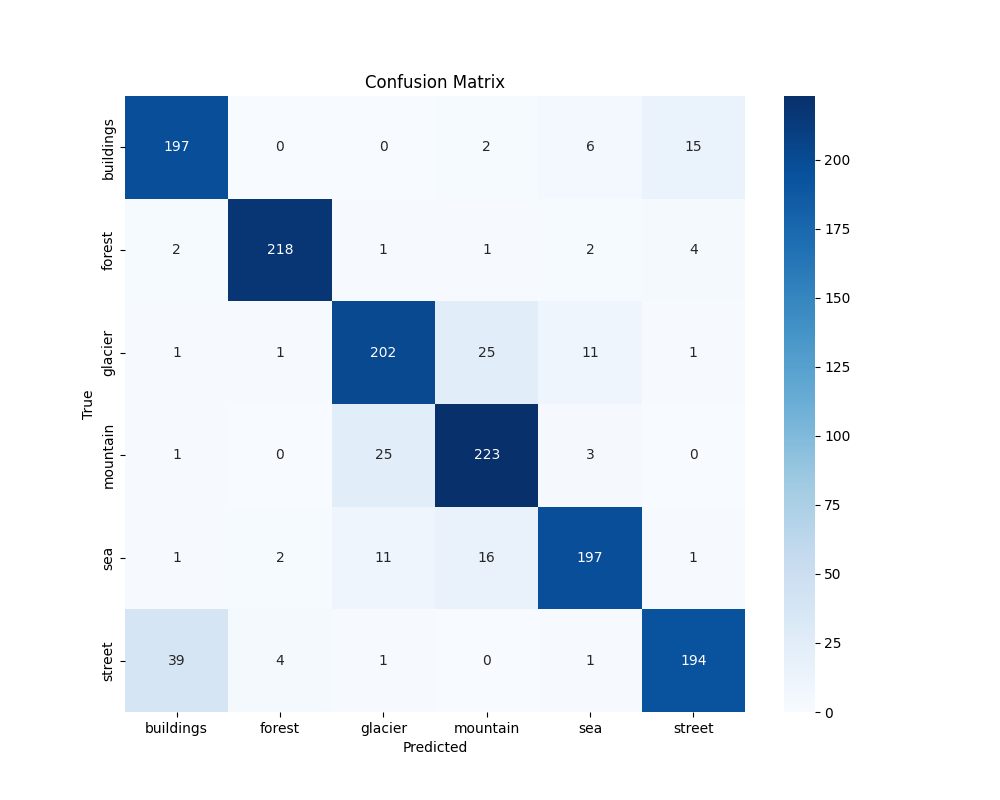

# Waste Material Classification - Model Training

This repository contains the training pipeline for a **waste classification** system using deep learning. It includes implementations in **both TensorFlow and PyTorch**, focusing on classifying waste images into categories such as plastic, metal, glass, etc.

---

## Objective

To build and compare robust CNN models using TensorFlow and PyTorch for waste classification using image data. This forms part of a portfolio-ready end-to-end ML project including model training, evaluation, and web deployment.

---

## Components

### TensorFlow Training

* Data Augmentation: `RandomFlip`, `RandomZoom`, `RandomRotation`, etc.
* CNN Layers + BatchNorm + Dropout
* `GlobalAveragePooling2D` + Dense layers
* Regularization with `L1L2`
* `EarlyStopping` and `ModelCheckpoint` callbacks

### PyTorch Training

* CNN architecture with similar depth and regularization
* `AdaptiveAvgPool2d` instead of GAP
* `Dropout` and `BatchNorm` used
* Best model saved using `torch.save`

---

## Repository Structure

```
.
├── tensorflow_training/     # TensorFlow training scripts
├── pytorch_training/        # PyTorch training scripts
├── reports/                 # Confusion matrices and evaluation visuals
├── best_model.keras         # Best TensorFlow model
├── best_model.pth           # Best PyTorch model
├── Data/
│   ├── train/
│   ├── val/
│   └── test/
├── requirements.txt         # Dependencies
└── README.md
```

---

## Evaluation Results

* **TensorFlow**

  * Best Val Accuracy: **83.0%**, Val Loss: **0.5870**
* **PyTorch**

  * Best Val Accuracy: **87.1%**, Val Loss: **0.3473**

### Evaluation Metrics (Seaborn + Matplotlib):

* Classification Reports
* Confusion Matrices

#### TensorFlow Model

<div align="center">
  
</div>

#### PyTorch Model

<div align="center">
  
</div>

---

## How to Train

### TensorFlow

```bash
python TFTrain.py
python TFTest.py
```

### PyTorch

```bash
python TorchTrain.py
python TorchTest.py
```

Make sure your dataset is placed in the `Data/` directory with subfolders:

```
Data/
├── train/
├── val/
└── test/
```

---

## Dependencies

```bash
pip install -r requirements.txt
```

* TensorFlow ≥ 2.11
* PyTorch ≥ 2.0
* matplotlib, seaborn, scikit-learn

GPU acceleration is recommended if available.

---

## Highlights

* Dual framework training (TF + Torch)
* Data augmentation and regularization
* Clean modular design for reproducibility
* Evaluation visualizations for clarity
* Ready for deployment in Flask app

---

## License

MIT License – see `LICENSE` for full details.

---

## Author

Created by **JAGAN-JGUN** for professional portfolio showcasing.

---

## Contact

For queries or collaboration:

* GitHub: [JAGAN-JGUN](https://github.com/JAGAN-JGUN)
* Email: [jaganjgun008@gmail.com](jaganjgun008@gmail.com)
